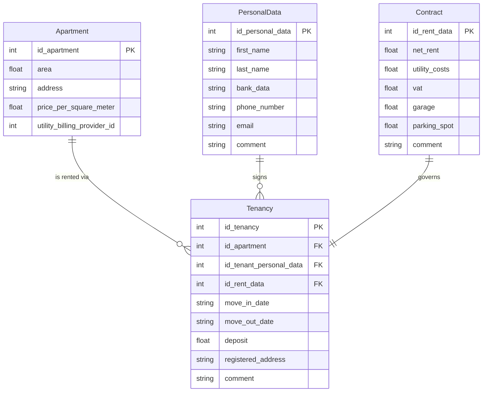
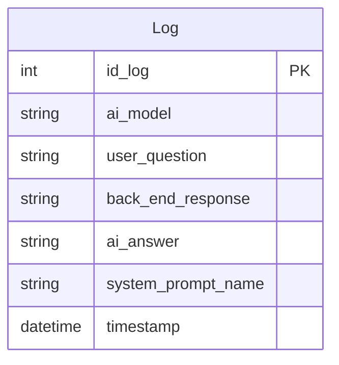

# ORM Table Relationships

This document outlines the structure and relationships of the ORM tables in the application.

## Rental Database (`apartment_app.db`)

The rental database manages the core business logic: apartments, tenants, contracts, and their associations.

### Tables

1.  **Apartment**
    *   **Table Name:** `apartment`
    *   **Primary Key:** `id_apartment`
    *   **Description:** Represents a physical apartment unit.

2.  **Tenancy**
    *   **Table Name:** `tenancy`
    *   **Primary Key:** `id_tenancy`
    *   **Foreign Keys:**
        *   `id_apartment` references `Apartment(id_apartment)`
        *   `id_tenant_personal_data` references `PersonalData(id_personal_data)`
        *   `id_rent_data` references `Contract(id_rent_data)`
    *   **Description:** Represents a specific rental period, linking an apartment, a tenant, and a contract.

3.  **PersonalData**
    *   **Table Name:** `personal_data`
    *   **Primary Key:** `id_personal_data`
    *   **Description:** Stores personal information about tenants.

4.  **Contract**
    *   **Table Name:** `rent_data`
    *   **Primary Key:** `id_rent_data`
    *   **Description:** Stores financial details of the rental agreement (rent, utilities, etc.).

### Entity Relationship Diagram

## Logs Database (`log_conversation.db`)

The logs database is separate and stores conversation history and system logs.

### Tables

1.  **Log**
    *   **Table Name:** `log_conversation`
    *   **Primary Key:** `id_log`
    *   **Description:** Stores individual log entries for AI interactions.

